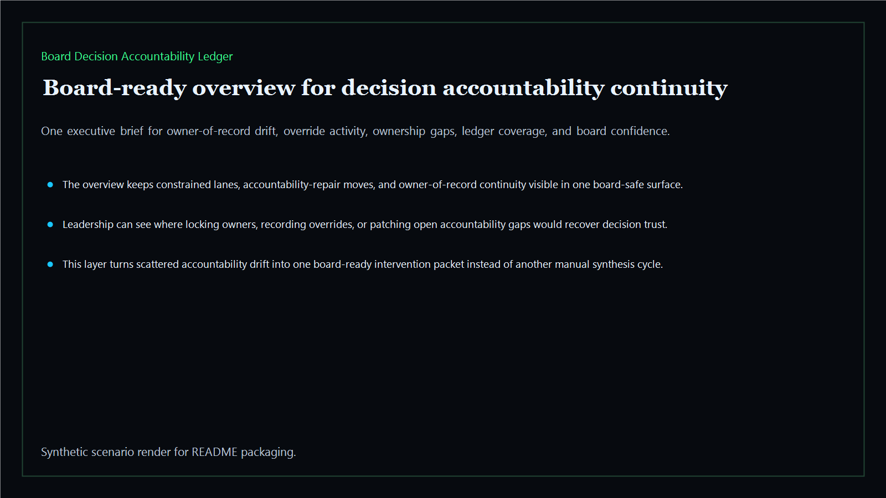
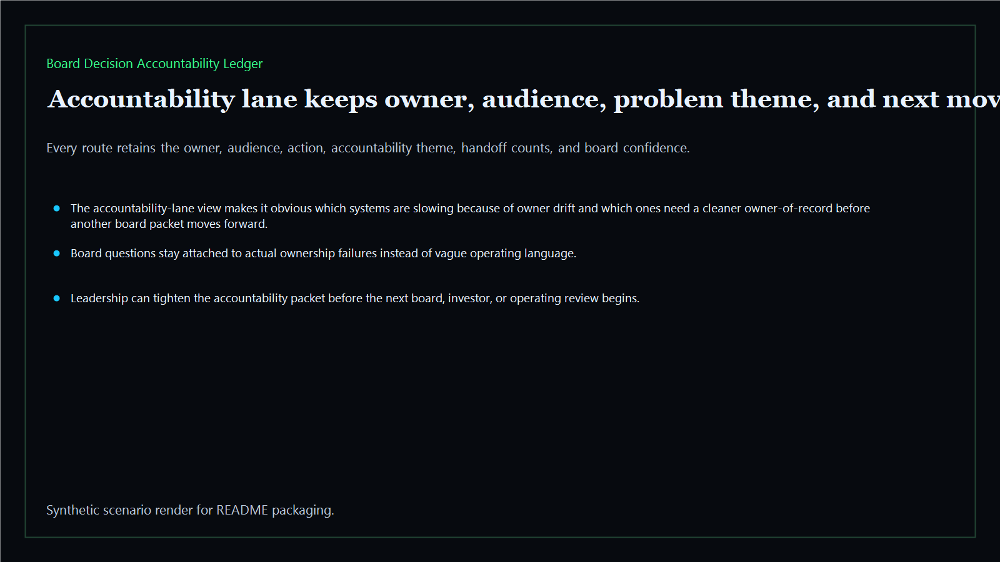
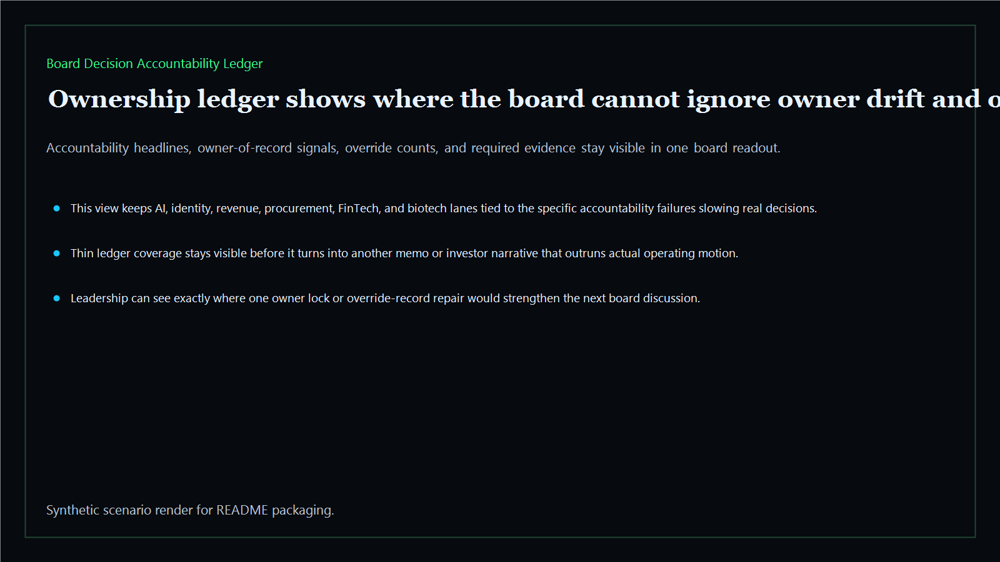
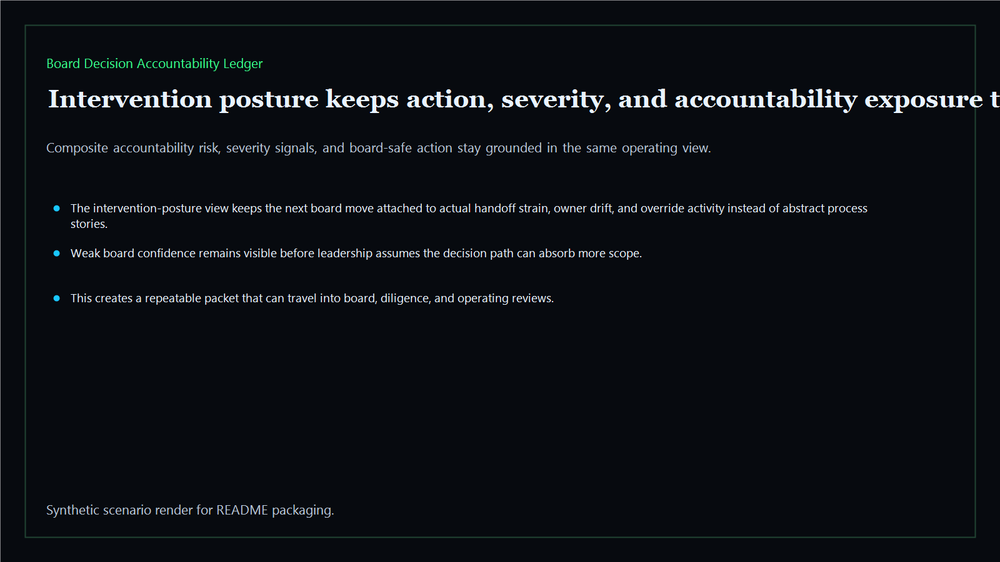

# Board Decision Accountability Ledger

Board-ready accountability-ledger surface for tracking final decision owners, approval continuity, and board-visible ownership discipline across the executive estate.

- Live: `https://accountability.kineticgain.com/`
- Repo: `mizcausevic-dev/board-decision-accountability-ledger`

## Why this matters

Leaders need more than one-time reset calls. They need one surface that shows who now owns the final decision, where accountability continuity is still weak, and how ownership discipline holds over time.

## Product depth

- TypeScript executive-intelligence surface for accountability ledgers with modeled owner-of-record lanes, continuity gaps, accountability repair, and board-safe intervention posture
- synthetic executive lanes across AI, identity, revenue, FinTech, biotech, procurement, and public-sector readiness
- reusable outputs for escalation lanes, handoff ledgers, intervention packets, and board-ready operating memos
- prerendered static site, JSON payloads, screenshots, and docs

## What these repos have in common

Kinetic Gain products turn fragmented operating signals into one board-readable decision surface. Each repo keeps the same core pattern visible:

- **risk is explicit**: the page names where execution, ownership, evidence, cost, or compliance pressure is building
- **ownership is attached**: every lane keeps an accountable owner, audience, and next action close to the signal
- **evidence is portable**: generated JSON, screenshots, and docs make the proof reusable in diligence, board packets, and GTM narratives
- **decisions are staged**: the output helps leaders decide what to simplify, standardize, automate, escalate, or fund next

For this ledger, the product story is accountability repair. It shows which owner-of-record lanes are losing continuity, where override behavior is distorting the operating model, and what evidence a board or investor would need before trusting the next decision packet.

## Operating workflow

1. Load the synthetic accountability packet from `fixtures/board-decision-accountability-ledger.json`.
2. Score each lane for handoffs, ownership gaps, override activity, ledger coverage, clarity, and board confidence.
3. Render the executive surface, JSON APIs, screenshots, and docs from the same dataset.
4. Use the board brief to decide which lane needs owner reset, evidence hardening, or escalation before the next review cycle.

## Routes

- `/`
- `/accountability-lane`
- `/ownership-ledger`
- `/intervention-posture`
- `/verification`
- `/docs`

## Local run

```bash
cd board-decision-accountability-ledger
npm install
npm run verify
npm run prerender
npm run render:assets
```

## CLI

```bash
npx board-decision-accountability-ledger fixtures/board-decision-accountability-ledger.json --format summary
npx board-decision-accountability-ledger fixtures/board-decision-accountability-ledger-clean.json --format json
```

## Docs

- [Architecture](docs/architecture.md)
- [Origin](docs/ORIGIN.md)
- [Kinetic Gain Embedded](docs/KINETIC_GAIN_EMBEDDED.md)

## Screenshots





